# FuWo Website-Architektur

```mermaid
graph TD
    subgraph PUBLIC["Öffentliche Seiten"]
        HOME["/  Startseite"]
        ARTIKEL["/artikel/[slug]  Artikel-Detail"]
        LIGA["/liga/[slug]  Liga-Seite"]
        TAG["/tag/[slug]  Tag-Seite"]
        VEREIN["/verein/[slug]  Vereins-Profil"]
        VEREINE["/vereine  Vereins-Übersicht"]
        JOBS["/jobs  Job-Übersicht"]
        JOBDETAIL["/jobs/[id]  Job-Detail"]
        JOBKAT["/jobs/kategorie/[slug]"]
        SPIEL["/spiel/[id]  Match-Detail"]
        TIPPSPIEL["/tippspiel  Scoreboard"]
        EPAPER["/epaper  ePaper"]
        CROWDFUNDING["/crowdfunding"]
        UNTERSTUETZEN["/unterstuetzen"]
        SUPPORTER["/supporter-wall"]
        GRUENDUNG["/gruendungself"]
        ARCHIV["/archiv"]
        ABO["/abo"]
        DESIGN["/design  Preview"]
        OFFLINE["/offline  PWA"]
    end

    subgraph USER["User-Bereich Auth"]
        LOGIN["/login"]
        ONBOARDING["/onboarding  3 Steps"]
        PROFIL["/profil"]
        GESPEICHERT["/gespeichert  Bookmarks"]
    end

    subgraph ADMIN["Admin-Bereich Rollen"]
        ADMINLOGIN["/admin/login"]
        DASHBOARD["/admin  Dashboard"]
        ADM_ARTICLES["/admin/articles  CRUD"]
        ADM_CLUBS["/admin/clubs  CRUD"]
        ADM_JOBS["/admin/jobs  CRUD"]
        ADM_VOTES["/admin/votes"]
        ADM_DATEN["/admin/daten"]
    end

    subgraph BACKEND["Backend"]
        SUPABASE[(Supabase)]
        subgraph TABLES["Tabellen"]
            T_PROFILES["profiles"]
            T_ARTICLES["articles"]
            T_CLUBS["clubs"]
            T_JOBS["jobs"]
            T_BOOKMARKS["bookmarks"]
            T_VOTES["match_votes"]
        end
        subgraph API["API Layer"]
            API_PROFILE["profile.ts"]
            API_ARTICLES["articles.ts"]
            API_CLUBS["clubs.ts"]
            API_JOBS["jobs.ts"]
            API_VOTES["votes.ts"]
            API_ADMIN["admin.ts"]
        end
        subgraph MOCK["Mock-Daten Fallback"]
            M_DATA["data.ts / clubs.ts / matches.ts"]
        end
    end

    subgraph INFRA["Infrastruktur"]
        NETLIFY["Netlify Static Export"]
        LANDING["fuwo.app Landing"]
        PWA["PWA + Icons"]
    end

    HOME --> ARTIKEL
    HOME --> LIGA
    HOME --> JOBS
    LIGA --> VEREIN
    VEREINE --> VEREIN
    JOBS --> JOBDETAIL
    LOGIN --> ONBOARDING
    ONBOARDING --> PROFIL

    DASHBOARD --> ADM_ARTICLES
    DASHBOARD --> ADM_CLUBS
    DASHBOARD --> ADM_JOBS

    ADM_ARTICLES --> API_ARTICLES
    ADM_CLUBS --> API_CLUBS
    ADM_JOBS --> API_JOBS
    API_ARTICLES --> SUPABASE
    API_ARTICLES -.-> MOCK
    API_CLUBS --> SUPABASE
    API_PROFILE --> SUPABASE
    LOGIN --> SUPABASE

    NETLIFY --> HOME
    NETLIFY --> LANDING
```

## Rollen (geplant)

| Rolle | Wer | Rechte |
|-------|-----|--------|
| **Admin** | 2-3 Leute | Alles: User verwalten, Einstellungen, Rollen zuweisen |
| **Redakteur** | Schreibende | Artikel, Bilder, Vereine, Jobs erstellen/bearbeiten |
